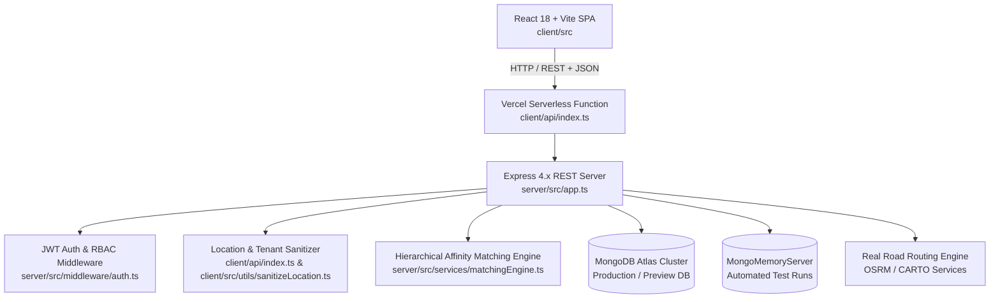

# IMPLEMENTATION MAP — COLLEGERIDE
**Version:** 1.0 (Phase P0-A Baseline)  
**Date:** September 2026  
**System Identity:** CollegeRide — Safe, Academic-Affinity Campus Carpooling & Mobility System

---

## 1. System Topology & Deployment Architecture

### Component Directory Mapping

| Layer | Path | Purpose / Responsibilities |
|---|---|---|
| **Client Frontend** | `client/src/` | Single-page application built with React 18, Vite 6, Tailwind CSS, Lucide icons, and React Router. |
| **Client Pages** | `client/src/pages/` | `DashboardPage`, `SearchRidesPage`, `RideDetailPage`, `PostRidePage`, `TripTrackingPage`, `AdminDashboardPage`, `VerificationStatusPage`, `FaceVerifyPage`, `SafetyPage`. |
| **Client Components** | `client/src/components/` | Reusable UI components including modals (`ChatModal`, `ReviewModal`, `DailyDriverIdCheckModal`), landing sections, and `PickupAndRouteNavigationMap`. |
| **Client Sanitizer** | `client/src/utils/sanitizeLocation.ts` | Enforces Dehradun/Premnagar/Selaqui corridor strings across UI rendering paths. |
| **Client Serverless Proxy** | `client/api/index.ts` | Vercel entrypoint running Express backend with wire-level payload sanitization for MongoDB Atlas documents. |
| **Server Application** | `server/src/app.ts` | Express application instance configuring Helmet, CORS, Morgan logger, JSON parsers, and route routers. |
| **Server Routes** | `server/src/routes/` | `authRoutes.ts`, `rideRoutes.ts`, `requestRoutes.ts`, `tripRoutes.ts`, `chatRoutes.ts`, `reviewRoutes.ts`, `adminRoutes.ts`, `safetyRoutes.ts`, `verificationRoutes.ts`. |
| **Server Models** | `server/src/models/` | Mongoose schemas for `User`, `Ride`, `RideRequest`, `Trip`, `Conversation`, `Review`, `Institution`, `Campus`, `PickupHub`, `Geofence`, `Vehicle`, `EmergencyIncident`, `AuditLog`. |
| **Server Services** | `server/src/services/` | `matchingEngine.ts` (Haversine corridor matching, academic affinity hierarchy rank 1–4, detour penalties). |
| **Server Seeds** | `server/src/seed.ts` | Deterministic demo seed containing verified students, vehicles, and active Dehradun corridor rides. |
| **Test Suites** | `server/tests/` | Jest test suites covering RBAC, authorization bypass, matching engine, security patches, real user registration, and live E2E flows (51 tests). |

---

## 2. Authentication & Authorization Boundaries

- **Tokens:** Signed JWT stored in client `localStorage` with Bearer scheme in `Authorization` headers.
- **Account Types & Roles:**
  - `student` / `PASSENGER`: Allowed to search rides, request seats, review completed rides, chat on booked rides, and trigger SOS.
  - `student` / `WOMEN_PASSENGER`: Filterable by `womenOnlyDriver` preference to match female-only drivers.
  - `driver` / `DRIVER`: Permitted to post rides, accept/reject requests, verify passenger pickup OTP/QR, and complete trips.
  - `campus_admin` / `ADMIN`: Dedicated access to university mobility metrics, verification queues, and audit trails. Blocked from student ride posting.
  - `safety_officer`: Dedicated incident escalation and campus perimeter monitoring.
- **Tenant Scope:** University institutional email gating (`@college.edu`, `@uuofficial.edu.in`, `@geu.ac.in`, `@upes.ac.in`).

---

## 3. Geographic Scope & Corridor Boundary

All geocoded hubs, boundaries, and routes are strictly bound to the Dehradun district:
- **Primary Corridor:** Premnagar — Suddhowala — Selaqui (Chakrata Road highway corridor).
- **Core Educational Hubs:**
  - **Uttaranchal University (UU)**: Main Gate 1 (30.3415, 77.9440), UIT Building (30.3432, 77.9448), Law College Dehradun (LCD).
  - **Graphic Era University (GEU)**: Bell Road Campus Gate 1 (30.2685, 77.9945), Clement Town Transit Bay (30.2695, 77.9955).
  - **UPES (Bidholi / Kandoli)**: Bidholi Main Gate (30.4162, 77.9712).
  - **Transit Hubs:** Premnagar Chowk Market (30.3340, 77.9620), Suddhowala Chowk (30.3475, 77.9320), Selaqui Industrial Bay (30.3685, 77.8540), Ballupur Chowk (30.3392, 78.0125).
- **Hard Restriction:** Zero Delhi / Metro / NCR references allowed anywhere in runtime, mock, seed, or client text.
